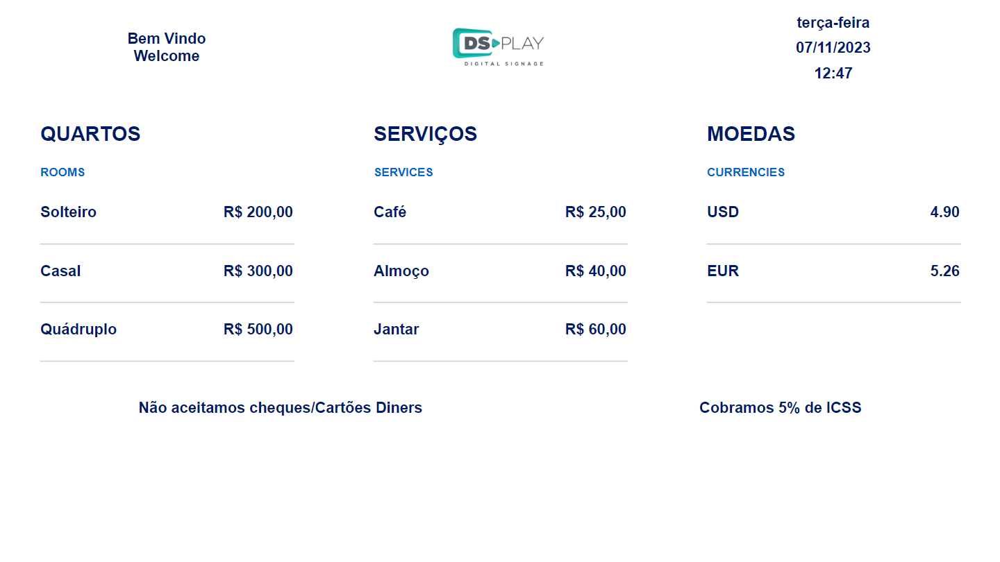
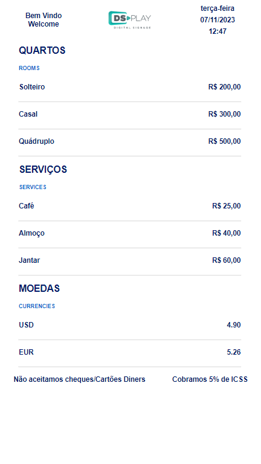
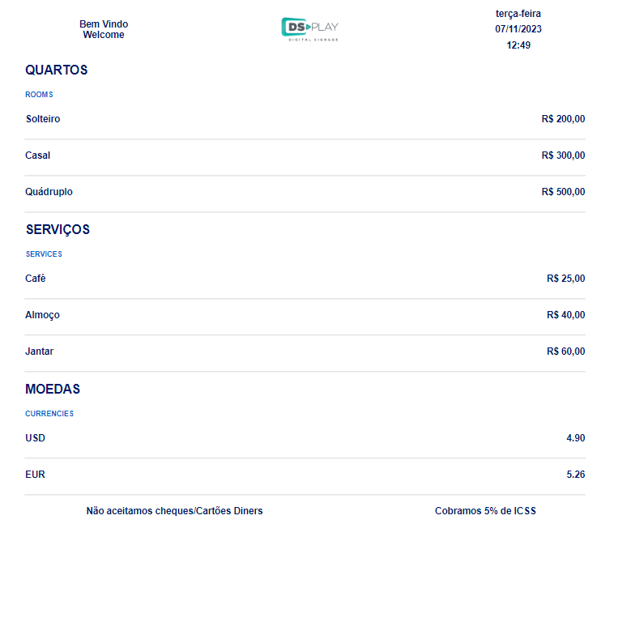

# DSPLAY - Currency Exchange Rate
- Template to display currency exchange rate and other informations.

## Supported Screen Formats/Resolutions

- Landscape

  
- Portrait

  
- Square

  

### Configuration

This template has some configuration variables as the following table shows:

| Variable              | Type    | Default    | Description                                        |
|-----------------------|---------|------------| ---------------------------------------------------|
| `topLeftText`            | object   | { title, subtitle }       | Text located in the top left section of the page   
| `mainContent1`            | object   | { title, subtitle, options }       | First table of contents on the main section                                  |
| `mainContent2`            | object   | { title, subtitle, options }       | Second table of contents on the main section                                  |
| `mainContent3`            | object   | { title, subtitle, currencies }       | Last table of contents on the main section, containing the currency exchange rate                                  |
| `logo` | text   | "https://www.urlExample.com" | Logo picture |
| `bottomLeftText` | text   | "Bottom Left Text" | Text located in the bottom left section of the page |
| `bottomRightText` | text   | "Bottom Right Text" | Text located in the bottom right section of the page |


mainContent1 [...]
| Variable              | Type    | Default    | Description                                        |
|-----------------------|---------|------------| ---------------------------------------------------|
| `title`        | text   | ""    | Title   |
| `subtitle`        | text   | ""    | Subtitle    |
| `options`        | array   | ""    | Array of objects, each one containing 'type' (title) and 'other' (value). Eg.: { type: "Coffee", other: "R$ 25,00" }    |

mainContent2 [...]
| Variable              | Type    | Default    | Description                                        |
|-----------------------|---------|------------| ---------------------------------------------------|
| `title`        | text   | ""    | Title   |
| `subtitle`        | text   | ""    | Subtitle    |
| `options`        | array   | ""    | Array of objects, each one containing 'type' (title) and 'other' (value). Eg.: { type: "Coffee", other: "R$ 25,00" }    |

mainContent3 [...]
| Variable              | Type    | Default    | Description                                        |
|-----------------------|---------|------------| ---------------------------------------------------|
| `title`        | text   | ""    | Title   |
| `subtitle`        | text   | ""    | Subtitle    |
| `currencies`        | array   | ""    | Array of strings. All possible currencies in "https://cdn.jsdelivr.net/gh/fawazahmed0/currency-api@1/latest/currencies/brl.json". Eg.: currencies: ["usd", "eur"]   |


topLeftText [...]
|Attributes             | Type    | Example    | Description                                        |
|-----------------------|---------|------------| ---------------------------------------------------|
| `title`         | text   | ""    | Title    |
| `subtitle`          | text   | ""    | Subtitle    |


## Getting started
```
  git clone https://github.com/MontMor4/template-cotacao-moedas.git my-awesome-template
  cd my-awesome-template
  rm -rf .git
  npm install
  npm start
```

## Packing (release build)
  To create a release build of the template, ready to be uploaded to DSPLAY, just run:
  ```
    npm run zip
  ```
  It will generate a template.zip file ready to be deployed to [DSPLAY Web Manager](https://manager.dsplay.tv/template/create)

## More

The see more about DSPLAY HTML Templates, visit: https://developers.dsplay.tv/docs/html-templates
